# Diagramas de flujo

## Función validarCliente()

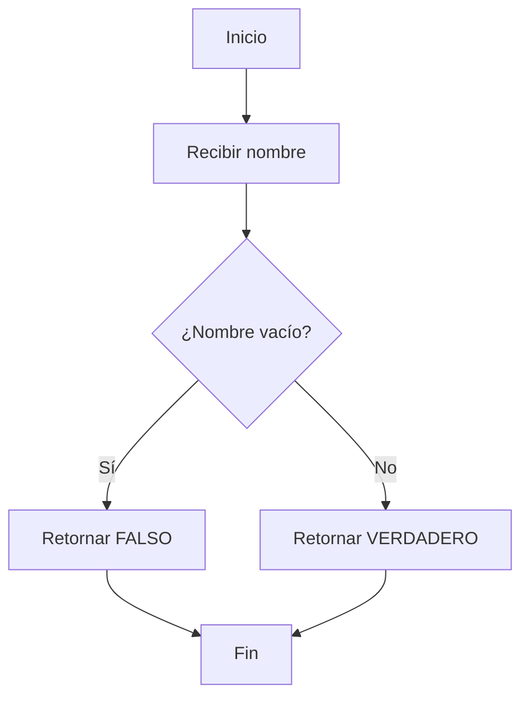

## Función validarTramite()

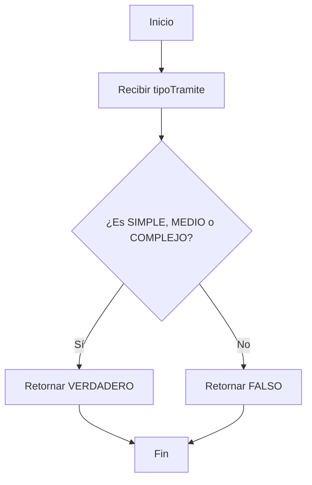

## Función determinarTiempoTramite()

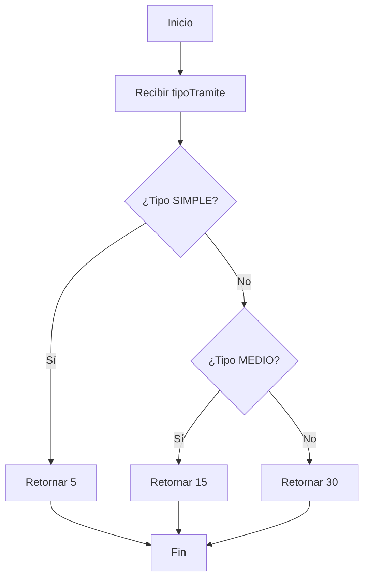

## Función crearTurno()
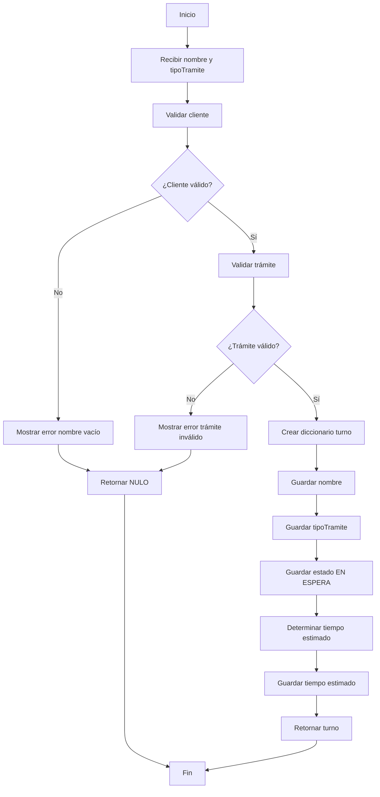

## Función agregarAFila()
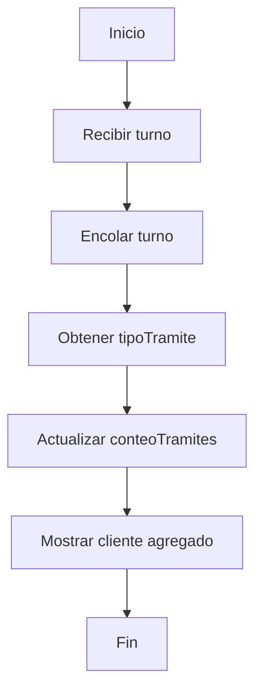

## Función atenderSiguiente()
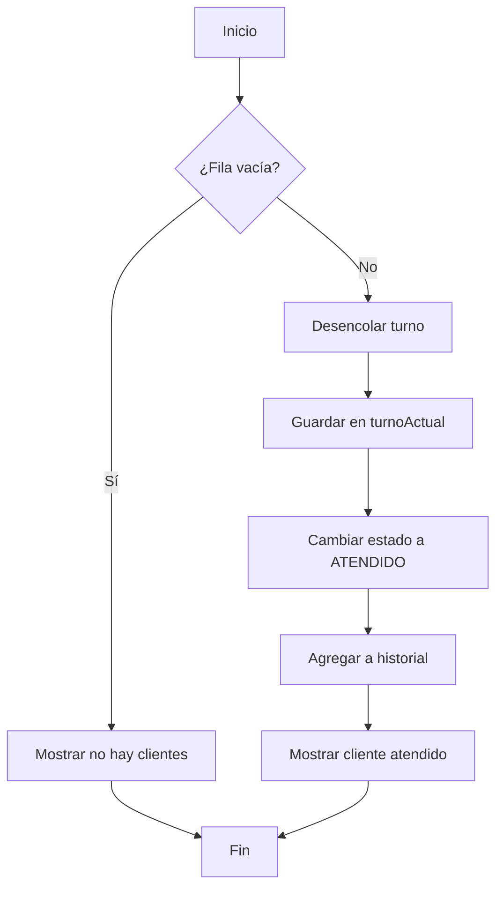

## Función calcularEsperaTotal()
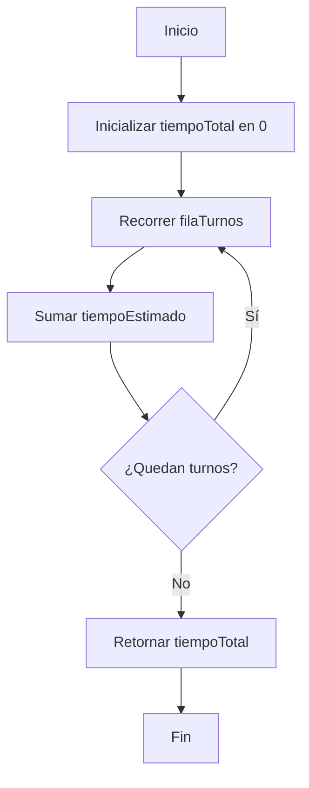

## Función mostrarFila() 
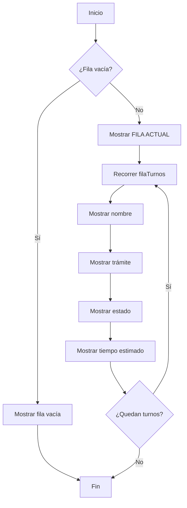

## Función mostrarTurnoActual()
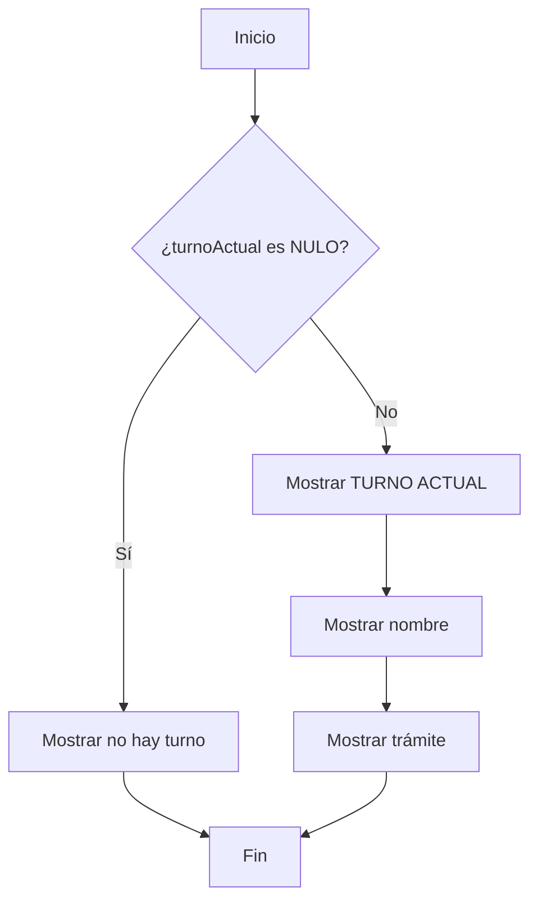

## Función determinarTramiteMasSolicitado()
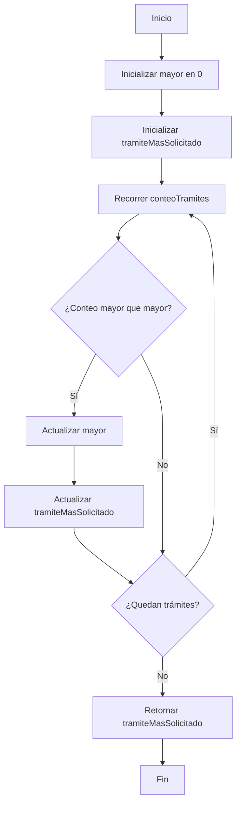

## Función generarReporteDia()
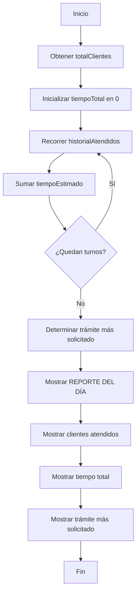

## Diagrama de flujo general del sistema

```mermaid
flowchart TD

A[Inicio del programa] --> B[Crear turno An


 SIMPLE]

B --> C{¿Turno válido?}

C -- Sí --> D[Agregar turno a la fila]

C -- No --> E[Continuar]

D --> E


E --> F[Crear turno Luis MEDIO]

F --> G{¿Turno válido?}

G -- Sí --> H[Agregar turno a la fila]

G -- No --> I[Continuar]

H --> I


I --> J[Crear turno Maria COMPLEJO]

J --> K{¿Turno válido?}

K -- Sí --> L[Agregar turno a la fila]

K -- No --> M[Continuar]

L --> M


M --> N[Crear turno vacío]

N --> O{¿Cliente válido?}

O -- No --> P[Mostrar error nombre vacío]

O -- Sí --> Q[Continuar]

P --> Q


Q --> R[Crear turno con trámite inválido]

R --> S{¿Trámite válido?}

S -- No --> T[Mostrar error trámite inválido]

S -- Sí --> U[Continuar]

T --> U


U --> V[Mostrar fila actual]

V --> W[Calcular tiempo total de espera]

W --> X[Mostrar tiempo total]

X --> Y[Atender siguiente cliente]

Y --> Z[Mostrar turno actual]

Z --> AA[Generar reporte del día]

AA --> AB[Fin del programa]
```